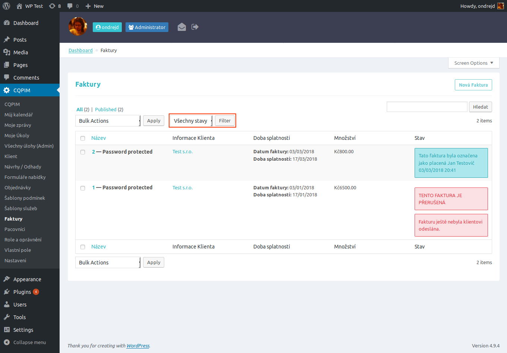

# Doplňky pro plugin CQPIM

Rozšíření pro [WordPress][1] plugin [CQPIM Project Management][2].

## Přehled vlastností

Plugin `odwp-cqpim_addon` přidává do pluginu __CQPIM__ tyto vlastnosti:

- nové metaboxy pro _CPT_ `cqpim_client`
- tyto metaboxy jsou promítnuty do admin. tabulky s klienty (včetně řazení a filtrování).
- nový filtr dle stavu zaplacení pro admin. tabulku s fakturami
- speciální formulář pro žádosti o předběžné objednávky nových klientů

## Obrázky pluginy

__Pozn.:__ Obrázek formuláře je s defaultním __WordPress__ tématem vzhledu.

### Úpravy pro tabulku klientů

### Úpravy pro formulář editace klienta

### Úpravy pro tabulku faktur

### Tabulka pro objednávku ve veřejné části

[1]: https://www.wordpress.org/
[2]: http://www.cqpim.uk/
